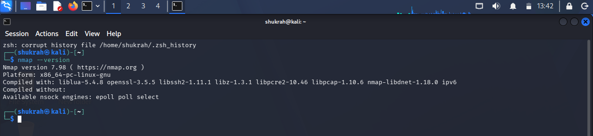
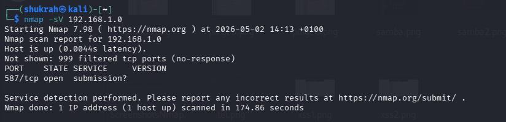

# nmap-notes
This repository documents my practical learning journey with Nmap as I build foundational penetration testing and reconnaissance skills.

# What you'll find
Commands I practiced
Scan types explained
Screenshots from Kali Linux
Key lessons learned
# Tools used
Kali Linux
Nmap
Terminal
GitHub
# Why I built this

I’m transitioning into cybersecurity and documenting my hands-on learning publicly as I grow toward ethical hacking and penetration testing.

# Screenshots
# Nmap Version

# Basic Scan

# Service Detection

# OS Detection

# Aggressive Scan

